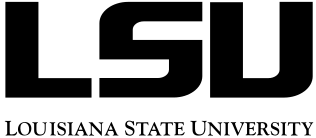

<a href="https://github.com/SunnySuite/Sunny.jl/">
    <picture>
        <source media="(prefers-color-scheme: dark)" srcset="https://raw.githubusercontent.com/SunnySuite/Sunny.jl/main/assets/sunny_logo-dark.svg">
        
    </picture>
</a>

| **Documentation**         | **Build Status**      | **Citation**            |
| :------------------------ | :-------------------- | :---------------------- |
| [![][docs-img]][docs-url] | [![][ci-img]][ci-url] | [![][doi-img]][doi-url] |

[docs-img]: https://img.shields.io/badge/docs-stable-blue.svg
[docs-url]: https://sunnysuite.github.io/Sunny.jl/stable
[ci-img]: https://github.com/SunnySuite/Sunny.jl/actions/workflows/CI.yml/badge.svg?branch=main
[ci-url]: https://github.com/SunnySuite/Sunny.jl/actions/workflows/CI.yml?query=branch%3Amain
[doi-img]: https://img.shields.io/badge/DOI-10.48550-blue
[doi-url]: https://doi.org/10.48550/arXiv.2501.13095

## Overview

Sunny is a Julia package for modeling magnetic materials. It emphasizes _symmetry-aware_ Hamiltonians, careful treatment of _quantum-spin_ degrees of freedom, and an extensive toolkit for _quantitative comparison with scattering data_, e.g., neutrons or x-rays. Ease of use is a priority: Sunny provides extensive documentation, robust model fitting capabilities, and interactive visualization tools.

## Try it out!

Start with the [Tutorials](https://sunnysuite.github.io/Sunny.jl/stable/examples/01_LSWT_CoRh2O4). For traditional linear spin wave theory, see also the [SpinW ports](https://sunnysuite.github.io/Sunny.jl/stable/examples/spinw/SW01_FM_Heseinberg_chain.html).

See [Getting Started](https://github.com/SunnySuite/Sunny.jl/wiki/Getting-started-with-Julia) for installation instructions. See [Release Notes](https://sunnysuite.github.io/Sunny.jl/dev/versions) for new features and breaking changes.

## Key features

Sunny supports most standard tools for modeling spin systems and also several unique ones. This includes:

- **Symmetry-guided modeling**, including enumeration of [symmetry-allowed couplings](https://sunnysuite.github.io/Sunny.jl/dev/examples/03_LSWT_SU3_FeI2.html#Symmetry-analysis), and propagation of interactions by symmetry equivalence.
- **General spin couplings**. [Arbitrary single-ion anisotropy](https://sunnysuite.github.io/Sunny.jl/dev/library.html#Sunny.set_onsite_coupling!) may be specified as Stevens-operator expansions or as general polynomials of spin operators. [Arbitrary multipolar coupling](https://sunnysuite.github.io/Sunny.jl/dev/library.html#Sunny.set_pair_coupling!) between pairs of sites is also supported.
- **Spin-wave theory** for calculating quantum spin excitations. This includes the usual dipole formalism ([example](https://sunnysuite.github.io/Sunny.jl/stable/examples/01_LSWT_CoRh2O4.html)) and its generalization to spin multipoles via multi-flavor bosons ([example](https://sunnysuite.github.io/Sunny.jl/stable/examples/03_LSWT_SU3_FeI2.html)). Sunny also supports special solvers for incommensurate spiral order ([example](https://sunnysuite.github.io/Sunny.jl/stable/examples/spinw/SW08_sqrt3_kagome_AFM.html)), and for scalability to very large disordered magnetic cells ([example](https://sunnysuite.github.io/Sunny.jl/stable/examples/09_Disorder_KPM.html)).
- **Finite-temperature dynamics and sampling**. This includes the Landau-Lifshitz dynamics with Langevin coupling to a thermal bath ([example](https://sunnysuite.github.io/Sunny.jl/stable/examples/02_LLD_CoRh2O4.html)) and its generalization to spin multipoles via SU(_N_) coherent states ([example](https://sunnysuite.github.io/Sunny.jl/stable/examples/04_GSD_FeI2.html)). Monte Carlo methods such as parallel tempering accelerate the sampling of highly frustrated magnets ([examples](https://github.com/SunnySuite/Sunny.jl/tree/main/examples/extra/Advanced_MC)).
- **Self-consistent Gaussian approximation** [(SCGA)](https://sunnysuite.github.io/Sunny.jl/stable/library.html#Sunny.SCGA) for efficient paramagnetic-phase observables, e.g. susceptibility and diffuse scattering intensity.
- **Long-range dipole-dipole interactions** with proper Ewald summation and customizable demagnetization tensor ([example](https://sunnysuite.github.io/Sunny.jl/stable/examples/07_Dipole_Dipole.html)).
- **Model fitting tools** for quantative analysis of experimental data, including discrete inelastic bands ([example]()) and diffuse scattering ([example]()).

Many of these features build on our team's [theoretical research](https://sunnysuite.github.io/Sunny.jl/stable/why.html#Advanced-theory-made-accessible).

Related packages include [SpinW](https://github.com/SpinW/spinw) (symmetry-guided spin wave theory), [McPhase](https://github.com/mducle/mcphase) (multi-flavor bosons for accurate treatment of spin multipoles), and [Spinteract](https://doi.org/10.48550/arXiv.2210.09016) (SCGA solvers and fitting). Moving up to the micromagnetics scale, [Vampire](https://vampire.york.ac.uk/) might be a good choice.

## Join our community

We want to interact with you! Please [join our Slack community](https://join.slack.com/t/sunny-users/shared_invite/zt-1otxwwko6-LzPtp7Fazkjx2XEqfgKqtA) and say hello. If you encounter a problem, please ask on the Slack `#helpdesk` channel. If you find Sunny useful, please cite this [software paper](https://arxiv.org/abs/2501.13095) and list your work on the [Literature Wiki](https://github.com/SunnySuite/Sunny.jl/wiki/Sunny-literature).

 

    <a href="https://www.lanl.gov">
    <picture>
        <source media="(prefers-color-scheme: dark)" srcset="assets/lanl-dark.svg">
        
    </picture>
    </a> &nbsp;&nbsp;
    <a href="https://www.utk.edu">
    <picture>
        <source media="(prefers-color-scheme: dark)" srcset="assets/utk-dark.svg">
        
    </picture>
    </a> &nbsp;&nbsp;
    <a href="https://www.gatech.edu">
    <picture>
        <source media="(prefers-color-scheme: dark)" srcset="assets/gatech-dark.svg">
        
    </picture>
    </a> &nbsp;
    <a href="https://www.ornl.gov/">
    <picture>
        <source media="(prefers-color-scheme: dark)" srcset="assets/ornl-dark.svg">
        
    </picture>
    </a> &nbsp;&nbsp;
    <a href="https://www.lsu.edu/">
    <picture>
        <source media="(prefers-color-scheme: dark)" srcset="assets/lsu-dark.svg">
        
    </picture>
    </a>

