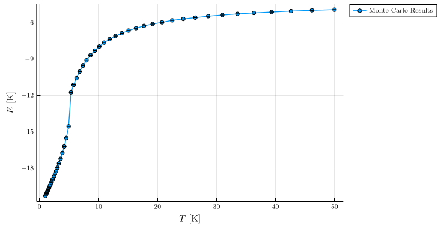

# Examples

The examples in this document are available in `examples/` as full loadable
files containing executable functions. Specifically, we work through here the
simulations performed in `examples/reproduce_testcases.jl`. The plotting
functions make use of [Plots.jl](http://docs.juliaplots.org/latest/) and
[Makie.jl](https://makie.juliaplots.org/stable/), which you should install from
Julia.

The high-level outline of performing a simulation is:

1. Create a [`Crystal`](@ref), either by providing explicit geometry information
    (Example 1), or by loading a `.cif` file (Example 2).
2. Using the `Crystal`, construct a collection of [Interactions](@ref).
3. Assemble a [`SpinSystem`](@ref) using the newly created `Crystal` and `Interaction`s, and the size of the simulation box.
4. Construct a sampler, either a [`LangevinSampler`](@ref) (Example 1), or a 
    [`MetropolisSampler`](@ref) (Example 2).
5. Use the sampler directly to sample new states, or use it to perform [Structure factor calculations](@ref).

Defining interactions in step (2) can be aided by our utilities for symmetry analysis, demonstrated at the bottom of this page.

In all examples, we will assume that `Sunny` and
`LinearAlgebra` have been loaded:

```julia
using Sunny
using LinearAlgebra
```

## Example 1: Diamond lattice with antiferromagnetic Heisenberg interactions

In this example, we will step through the basic steps needed to set up and run
a spin dynamics simulation, with finite-$T$ statistics obtained by using Langevin
dynamics. The full example is contained in the function `test_diamond_heisenberg_sf()`
within `examples/reproduce_testcases.jl`.

**(1)** We construct a diamond crystal by explicitly defining the eight atom
positions in the conventional cubic unit cell,

```julia
a = 1.0
lat_vecs = lattice_vectors(a, a, a, 90, 90, 90)
basis_vecs = [
    [0, 0, 0],
    [2, 2, 0],
    [1, 1, 1],
    [3, 3, 1],
    [2, 0, 2],
    [0, 2, 2],
    [3, 1, 3],
    [1, 3, 3],
] / 4
crystal = Crystal(lat_vecs, basis_vecs)
```

The terminal will display information about the automatically-inferred symmetry
information for the cell.

One can optionally enter atom types, which affects the inferred spacegroup. For
example, `Crystal(lat_vecs, basis_vecs; types=["A", "A", "B", "B", "A", "A",
"B", "B"])` would produce a crystal with reduced symmetry.

A more concise way to create the diamond crystal is using the space group
number, which automatically fills in all symmetry equivalent positions,

```julia
crystal = Crystal(lat_vecs, [[0, 0, 0]], 227; setting="1")
```

For spacegroup 227 (symbol "F d -3 m"), there are two possible conventions for
the unit cell origin. Leaving off the `setting` option returns all possible
crystals.

**(2)** Next, we need to define our Heisenberg interactions. We want to set up
nearest-neighbor antiferromagnetic interactions with a strength of ``J = 28.28~\mathrm{K}``.
One nearest-neighbor bond is the one connecting basis index 1 with basis index 3 within a
single unit cell. (We can figure this out using our tools for symmetry analysis, at the
bottom of this page).

```julia
J = 28.28           # Units of K
interactions = [
    heisenberg(J, Bond(1, 3, [0,0,0])),
]
```

**(3)** Assembling a `SpinSystem` is straightforward -- provide the `Crystal`,
the `Interaction`s, along with the dimensions of the simulation box in units of
the lattice vectors. Then, we will randomize the system so that all spins are
randomly placed on the unit sphere.

```julia
sys = SpinSystem(crystal, interactions, (8, 8, 8))
rand!(sys)
```

The `SpinSystem` type is the central type used throughout our simulations. Internally, it contains the spin degrees of freedom which evolve during the simulation as well as the Hamiltonian defining how this evolution should occur. This type can be indexed into as an array of size `B×Lx×Ly×Lz`, with the first index selecting the sublattice and the remaining three selecting the unit cell, and the spin located at the  will given. For example, `sys[2, 5, 5, 5]` gives the spin variable located on the second sublattice in the unit cell, which is fifth along each axis.

**(4)** We will simulate this system using Langevin dynamics, so we need to create a [`LangevinSampler`](@ref). Note that the units of integration time and temperature are relative to the units implicitly used when setting up the interactions.

```julia
Δt = 0.02 / J       # Units of 1/K
kT = 4.             # Units of K
α  = 0.1
kB = 8.61733e-5     # Units of eV/K
nsteps = 20000
sampler = LangevinSampler(sys, kT, α, Δt, nsteps)
```

At this point we can call `sample!(sampler)` to produce new samples of the system, which will be reflected in the state of `sysc`. Instead, we will proceed to calculate
the finite-$T$ structure factor using our built-in routines.

**(5)** The full process of calculating a structure factor is handled
by [`dynamic_structure_factor`](@ref). Internally, this function:

1. Thermalizes the system for a while
2. Samples a new thermal spin configuration
3. Performs constant-energy LL dynamics to obtain a Fourier-transformed
    dynamics trajectory. Use this trajectory to calculate a structure
    factor contribution ``S^{α,β}(𝐪, ω)``.
4. Repeat steps (2,3), averaging structure factors across samples.

See the documentation of [`dynamic_structure_factor`](@ref) for details of how
this process is controlled by the function arguments, and how to properly
index into the resulting type [`StructureFactor`](@ref). Currently,
the main way to interact with this type is to index into its
`sfactor` attribute, which is a large array storing ``S^{α,β}(𝐪, ω)`` on a grid of ``𝐪`` points and frequencies.

In this example, we will just look at the diagonal elements of this
matrix along some cuts in reciprocal space. To improve statistics,
we average these elements across the ``x, y, z`` spin directions since
they are all symmetry equivalent in this model.

```julia
meas_rate = 10
dynsf = dynamic_structure_factor(
    sys, sampler; therm_samples=5, dynΔt=Δt, meas_rate,
    dyn_meas=1600, bz_size=(1,1,2), thermalize=10, verbose=true,
    reduce_basis=true, dipole_factor=false
)

# Retain just the diagonal elements, which we will average across the
#  symmetry-equivalent directions.
S = dynsf.sfactor
avgS = zeros(Float64, axes(S)[3:end])
for α in 1:3
    @. avgS += real(S[α, α, :, :, :, :])
end

```

We then plot some cuts using a function `plot_many_cuts` defined within
the example script. (I.e. this code block will not successfully execute unless
you `include("examples/reproduce_testcases.jl)`). We omit this code here as it's just
a large amount of indexing and plotting code, but for details see the script.

```julia
# Calculate the maximum ω present in our FFT
# Need to scale by (S+1) with S=3/2 to match the reference,
#  and then convert to meV.
maxω = 1000 * 2π / ((meas_rate * Δt) / kB) / (5/2)
p = plot_many_cuts(avgS; maxω=maxω, chopω=5.0)
display(p)
```

## Example 2: FeI₂ with a complex collection of interactions

In this example, we work through performing a more complicated and realistic
simulation of FeI₂. While the number of interactions is much larger, the general
process will be remarkably similar. We will also see how to perform sampling using
Metropolis Monte Carlo through the [`MetropolisSampler`](@ref) type. The full example is
contained in the function `test_FeI2_MC()` within `examples/reproduce_testcases.jl`.

**(1)** As before, the first step is to make a [`Crystal`](@ref). However, this time
we will load the crystal directly from a common crystallographic file format
called a `.cif`. You can download the structure file from [this link](https://materials.springer.com/isp/crystallographic/docs/sd_0548497). Then, we can load it as:

```julia
crystal = Crystal("./FeI2.cif")
crystal = subcrystal(crystal, "Fe2+")
```

(Be sure to change `"./FeI2.cif"` to whatever filename you've locally saved the file as.)

As only the Fe atoms are spinful, the second line here is selecting out just them.
However, the [`subcrystal`](@ref) function critically retains information about
the symmetry of the crystal structure with the I atoms present, which is
important for symmetry-constraining allowed interactions between atoms.

**(2)** We proceed to define our Hamiltonian similarly as before, however
this time many more interactions are present. See the documentation on the
[Interactions](@ref) for extended descriptions of each. Note that the `diagm`
function from the `LinearAlgebra` package just makes a diagonal matrix from
the vector giving the diagonal.

```julia
# All units in meV
J1mat = [-0.397  0      0    
          0     -0.075 -0.261
          0     -0.261 -0.236]
J1 = exchange(J1mat, Bond(1, 1, [1, 0, 0]), "J1")
J2 = exchange(diagm([0.026, 0.026, 0.113]), Bond(1, 1, [1, -1, 0]), "J2")
J3 = exchange(diagm([0.166, 0.166, 0.211]), Bond(1, 1, [2, 0, 0]), "J3")
J0′ = exchange(diagm([0.037, 0.037, -0.036]), Bond(1, 1, [0, 0, 1]), "J0′")
J1′ = exchange(diagm([0.013, 0.013, 0.051]), Bond(1, 1, [1, 0, 1]), "J1′")
J2a′ = exchange(diagm([0.068, 0.068, 0.073]), Bond(1, 1, [1, -1, 1]), "J2a′")

D = easy_axis(2.165/2, [0, 0, 1], 1, "D")
interactions = [J1, J2, J3, J0′, J1′, J2a′, D]
```

To get better insight into the geometry and the long set of pair interactions
we've defined above, we can take a look at both using the following plotting
function: (you may want to adjust `markersize` to make the atoms easier to see):

```julia
using GLMakie
plot_bonds(crystal, interactions, (4,4,4); markersize=500)
```

Note that the Sunny plotting functions won't be available until you execute `using GLMakie`. Also keep in mind that GLMakie can be slow to load; it may take a minute or more to bring up the first plot. Subsequent plots should be significantly faster.

**(3)** As with the previous example, the next step is to make a `SpinSystem` and
randomize it. We'll simulate a fairly large box of size ``16\times 20\times 4``.

```julia
system = SpinSystem(crystal, interactions, (16, 20, 4))
rand!(system)
```

**(4)** In this example, we'll choose to work with Metropolis Monte Carlo rather
than Langevin sampling. This is necessary in this system due to a very
strong single-ion anisotropy (the `easy_axis` term) making the spins nearly
Ising-like. Continuous Langevin dyanmics can have ergodicity issues
in these situations, so we have to turn back to the standard Metropolis
randomized spin flip proposals.

```julia
kB = 8.61733e-2  # Boltzmann constant, units of meV/K
kT = 1.0 * kB    # Target simulation temp, in units of meV

sampler = MetropolisSampler(system, kT, 1000)
```

`MetropolisSampler` provides a very similar interface to `LangevinSampler`. Calling
`sample!(sampler)` will perform some number of spin-flip proposals, then return with
`system` updated to a new set of spin values. The `1000` in our constructor is asking
the sampler to perform 1000 sweeps through the system before the `sample!` function
should return.

**(5)**
As in the previous example, we are going to end with computing a dynamic structure
factor tensor using the `dynamic_structure_factor` function. A heuristic for choosing a
reasonable value of `Δt` using in the Landau-Lifshitz dynamics is `0.01` divided
by the largest energy scale present in the system. Here, that is the single-ion
anisotropy with a strength of `2.165/2 ` meV.

To make sure we don't do more work than really necessary, we set how
often `dynamic_structure_factor` internally stores snapshots (`meas_rate`) to
target a maximum frequency of `target_max_ω`. We also will only collect
the structure factor along two Brillouin zones along the first reciprocal axis,
by passing `bz_size=(2,0,0)`

The following block of code takes about five minutes on
a test desktop, but if it's taking too long you can
reduce the time either by reducing the number of sweeps
`MetropolisSampler` does, or the `num_samples` or
`num_meas` in the structure factor computation.

```julia
Δt = 0.01 / (2.165/2)       # Units of 1/meV
# Highest energy/frequency we actually care about resolving
target_max_ω = 10.          # Units of meV
# Interval number of steps of dynamics before collecting a snapshot for FFTs
meas_rate = convert(Int, div(2π, (2 * target_max_ω * Δt)))

sampler = MetropolisSampler(system, kT, 500)
println("Starting structure factor measurement...")
S = dynamic_structure_factor(
    system, sampler; therm_samples=15, thermalize=15,
    bz_size=(2,0,0), reduce_basis=true, dipole_factor=true,
    dynΔt=Δt, meas_rate=meas_rate, dyn_meas=1000, verbose=true, 
)
```

Here, given the full complex-valued ``\mathcal{S}^{\alpha \beta}(\boldsymbol{q}, \omega)``,
we are asking with `dipole_factor=true` to have this reduced to a single real-value 
by projecting each `\mathcal{S}^{\alpha \beta}` using the neutron dipole factor.
(See [Structure factor calculations](@ref). To be truly comparable to experiment, a
few more steps of processing need to be done which are currently unimplemented.)

(Will add info here about plotting when better structure factor plotting functions
are implemented.)

In the following example, we'll take a closer look at how to make
some more manual measurements of the system.

## Example 3: Making manual measurements within a Monte Carlo simulation

In this example, we will perform an extended Monte Carlo simulation of the
same system as in the previous example, but will perform a careful
thermal annealing down to low temperatures and measure an ``E(T)`` curve
along the way. To do so, we will need to use the sampling tools a bit
more manually.

As we're using the same system as before, the setup will be identical. The lines
are copied below for convenience, but see the previous example for an
explanation of each step.

```julia
crystal = Crystal("./FeI2.cif")
crystal = subcrystal(crystal, "Fe2+")

# All units in meV
J1mat = [-0.397  0      0    
          0     -0.075 -0.261
          0     -0.261 -0.236]
J1 = exchange(J1mat, Bond(1, 1, [1, 0, 0]), "J1")
J2 = exchange(diagm([0.026, 0.026, 0.113]), Bond(1, 1, [1, -1, 0]), "J2")
J3 = exchange(diagm([0.166, 0.166, 0.211]), Bond(1, 1, [2, 0, 0]), "J3")
J0′ = exchange(diagm([0.037, 0.037, -0.036]), Bond(1, 1, [0, 0, 1]), "J0′")
J1′ = exchange(diagm([0.013, 0.013, 0.051]), Bond(1, 1, [1, 0, 1]), "J1′")
J2a′ = exchange(diagm([0.068, 0.068, 0.073]), Bond(1, 1, [1, -1, 1]), "J2a′")

D = easy_axis(2.165/2, [0, 0, 1], 1, "D")
interactions = [J1, J2, J3, J0′, J1′, J2a′, D]

system = SpinSystem(crystal, interactions, (16, 20, 4))
rand!(system)

sampler = MetropolisSampler(system, 1.0, 10)
```

Now, our goal in the following is to measure an entire ``E(T)`` curve, down
to relatively low temperatures. To help the system find the ground state
correctly at low temperatures, we will use the same system throughout and
slowly "anneal" the temperature from the highest value down to the lowest.

These next few lines are pure Julia which simply sets up the temperatures
we want to measure along, and initializes some `Vector`'s to store some
data during the simulations.

```julia
kB = 8.61733e-2             # Boltzmann constant, units of meV/K

# Units of Kelvin, matching Xiaojian's range
temps = 10 .^ (range(log10(50), stop=0, length=50))
temps_meV = kB .* temps
energies = Float64[]
energy_errors = Float64[]
```

We've chosen to measure along a logarithmic temperature grid spanning ``T \in [1, 50]``,
so that we pack the grid points tighter at lower temperatures where interesting
things occur. `energies` and `energy_errors` are going to hold our measurements 
of the mean energy and the errors at each temperature.

Now, we're going to loop over these temperatures (moving from higher to lower temperatures). At each temperature, we're going to:

1. Set the temperature of the sampler to the new temperature using `set_temp!`.
2. Thermalize at the new temperature for a while before collecting
    measurements using `thermalize!`.
3. Sample the system 1000 times, and measure the energy of each spin
    configuration. We'll record all of these energies in `temp_energies`.
4. Compute the mean energy and its standard error from our 1000 measurements
5. Push this mean energy and standard error to our `energies` and 
    `energy_errors` vectors.

For simplicity, here we're just going to use the standard error across
all energy measurements as the error. See the `binned_statistics`
function in `examples/reproduce_testcases.jl` to see how to
measure the error more carefully.

The following block of code takes a few minutes to execute. Feel free to sample a sparser temperature grid, play around with some of the thermalization parameters, or perform fewer measurements to try to get it to execute faster.

Note the use of `running_energy(sampler)`. In some samplers, such as
`MetropolisSampler`, it is very efficient to maintain the current system energy
by updating with the local energy changes every time a spin flips. (In other
samplers, such as `LangevinSampler`, this is not the case and `running_energy`
simply does a full energy recalculation).

However, the "running" in running energy refers to the fact that if you
hand-modify the `system`, this running tally may no longer be correct! You can
restart the tally (by recomputing the full system energy from scratch) using
`reset_energy!(sampler)`. Similar functions exist for the total magnetization
(`running_mag(sampler)` and `reset_mag!(sampler)`).

```julia
using Statistics

for (i, temp) in enumerate(temps_meV)
    println("Temperature $i = $(temp)")

    temp_energies = Float64[]
    set_temp!(sampler, temp)
    thermalize!(sampler, 100)
    for _ in 1:1000
        sample!(sampler) 
        push!(temp_energies, running_energy(sampler))
    end
    meanE = mean(temp_energies)
    errE  = std(temp_energies) / sqrt(length(temp_energies))
    push!(energies, meanE)
    push!(energy_errors, errE)
end

# Convert energies into energy / spin, in units of K
energies ./= (length(system) * kB)
energy_errors ./= (length(system) * kB)
```

Now, we can plot what we've gotten! If you have the Plots.jl library installed you can do this as:

```julia
using Plots

p = plot(temps, energies, yerror=energy_errors, marker=:true, ms=3, label="Monte Carlo Results")
xlabel!(L"$T$ [K]")
ylabel!(L"$E$ [K]")
p
```

If all has gone well, you should get a plot that looks
something like the following:



We can take a look at the final low-energy spin configuration
by:

```julia
using GLMakie
plot_spins(system; arrowsize=1.5, arrowlength=3, linewidth=0.5)
```

You should see antiferromagnetic stripes within each
``c``-plane, which shift by one  as you
move up each plane!


## Symmetry analysis

When defining pair interactions, we are always defining the interactions on
entire symmetry classes at the same time. To do this, we need to provide the
exchange matrix ``J`` for a specific `Bond`, which is then automatically
propagated to all symmetry-equivalent bonds. Any given bond has symmetry
constraints that restrict the allowed space of ``3 \times 3`` coupling matrices.

To discover the symmetry allowed couplings for all bonds up to a certain
distance, we can use the function [`print_bond_table`](@ref).

```
lat_vecs = lattice_vectors(1, 1, 1, 90, 90, 90)
crystal = Crystal(lat_vecs, [[0, 0, 0]], 227; setting="1")
print_bond_table(crystal, 1.0)
```

which prints

```
Atom 1, position [0, 0, 0], multiplicity 8
Allowed single-ion anisotropy or g-tensor: | A  0  0 |
                                           | 0  A  0 |
                                           | 0  0  A |

Bond(1, 3, [0, 0, 0])
Distance 0.433, coordination 4
Connects [0, 0, 0] to [0.25, 0.25, 0.25]
Allowed exchange matrix: | A  B  B |
                         | B  A  B |
                         | B  B  A |

Bond(1, 2, [0, 0, 0])
Distance 0.7071, coordination 12
Connects [0, 0, 0] to [0.5, 0.5, 0]
Allowed exchange matrix: | A  C -D |
                         | C  A -D |
                         | D  D  B |
Allowed DM vector: [-D D 0]

Bond(2, 7, [0, 0, 0])
Distance 0.8292, coordination 12
Connects [0.5, 0.5, 0] to [0.75, 0.25, 0.75]
Allowed exchange matrix: | A  D  C |
                         | D  A -C |
                         | C -C  B |

Bond(1, 1, [1, 0, 0])
Distance 1, coordination 6
Connects [0, 0, 0] to [1, 0, 0]
Allowed exchange matrix: | A  0  0 |
                         | 0  B  0 |
                         | 0  0  B |
```

Each entry above makes reference to a specific `Bond`, but implicitly refers to
an entire class of symmetry equivalent bonds. For example, there are 4 symmetry
equivalent nearest neighbors in the diamond lattice (coordination number 4). To
find the ones starting from atom 2 we can use
[`all_symmetry_related_bonds_for_atom`](@ref),

```
julia> all_symmetry_related_bonds_for_atom(crystal, 2, Bond(1, 3, [0, 0, 0]))

4-element Vector{Bond{3}}:
 Bond(2, 7, [0, 0, -1])
 Bond(2, 8, [0, 0, -1])
 Bond(2, 3, [0, 0, 0])
 Bond(2, 4, [0, 0, 0])
```

You can query properties of a specific bond using [`print_bond`](@ref).

```
julia> print_bond(crystal, Bond(1, 6, [1,-1,0]))

Bond(1, 6, [1, -1, 0])
Distance 1.225, coordination 24
Connects [0, 0, 0] to [1, -0.5, 0.5]
Allowed exchange matrix: |   A  D+E -D-E |
                         | D-E    B    C |
                         |-D+E    C    B |
Allowed DM vector: [0 E E]
```