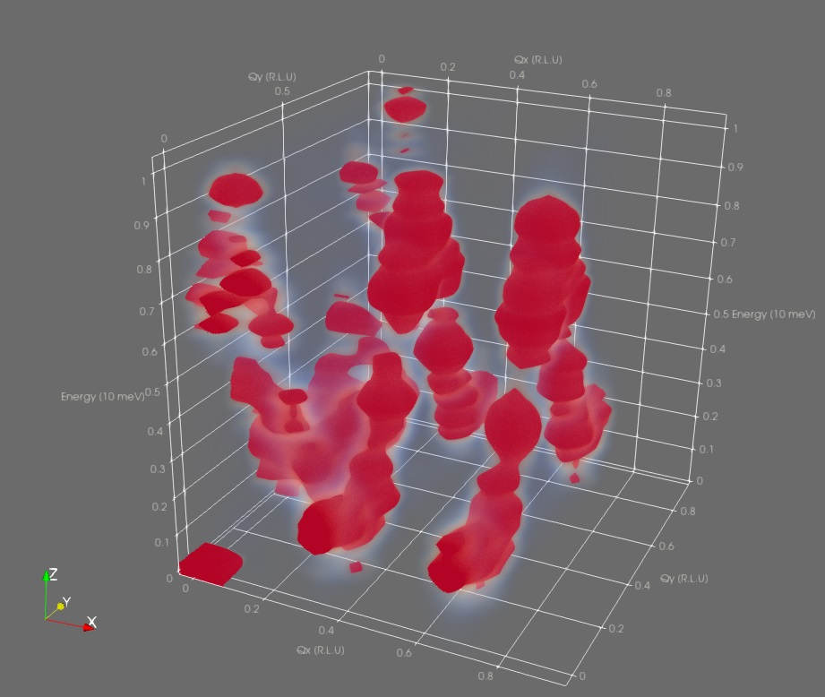

# ParaView Rendering

The 4D correlation data produced by Sunny is too high-dimensional to visualize
directly. This page describes how to export *3D slices* of correlation data from
Sunny to the Visual ToolKit (VTK) format, which is compatible with the
[ParaView](https://www.paraview.org/) visualization software. ParaView supports
volumetric rendering:

```@raw html

```

## Simulation data

First, generate some correlation data in Sunny. We will use a 2D lattice, since
the correlation data ``S(Q_x,Q_y,\omega)`` is 3D and can be exported in its
entirety. The following code sets up the system, thermalizes it, and records the
correlation data in a `SampledCorrelations` called `dsf`.

```julia
using Sunny

latvecs = lattice_vectors(8.,8.,12.,90,100,90)
positions = [[0,0,0]]
types = ["Cu"]
formfactors = [FormFactor("Cu2")]
xtal = Crystal(latvecs, positions; types)

sys = System(xtal, [1 => Moment(s=1/2, g=2)], :SUN; dims=(12, 12, 1), seed=1)

J = 10.
set_exchange!(sys, J, Bond(1,1,[1,0,0]))
set_exchange!(sys, J, Bond(1,1,[0,1,0]))

dt = 0.01
kT = 0.5
langevin = Langevin(dt; damping=0.5, kT)
randomize_spins!(sys)
for i in 1:10_000 # Long enough to reach equilibrium
    step!(sys, langevin)
end 

ωmax=10.
dsf = SampledCorrelations(sys; dt, energies=range(0, ωmax, 48))

nsamples = 10
for _ in 1:nsamples
    for _ in 1:1000 
        step!(sys, langevin)
    end
    add_sample!(dsf, sys)
end
```

The default histogram [`BinningParameters`](@ref) are already integrated over the ``z`` direction because the system is 2D:

```julia
unit_resolution_binning_parameters(dsf)
```

```
⊡    12 bins from -0.042 to +0.958 along [+1.27 dx] (Δ = 0.065)
⊡    12 bins from -0.042 to +0.958 along [+1.27 dy] (Δ = 0.065)
∫ Integrated from +0.000 to +0.000 along [-0.33 dx +1.88 dz] (Δ = 0.524)
⊡    48 bins from -0.107 to +10.134 along [+1.00 dE] (Δ = 0.213)
```

The histogram is very oblong; it's approximately `1x1x10`.
To make it a nicer shape, we will rescale the energy axis to be be fractions of `ωmax`:

```julia
params = unit_resolution_binning_parameters(dsf)
scale_factor = ωmax
params.binend[4] /= scale_factor
params.binstart[4] /= scale_factor
params.binwidth[4] /= scale_factor
params.covectors[4,:] ./= scale_factor
```

Doing this changes the last axis of the histogram to fit in [0,1]:

```
⊡    49 bins from -0.011 to +1.013 along [+0.10 dE] (Δ = 0.213)
```

Now that our histogram is a cube, we compute the intensity in the histogram bins
using the usual `intensities_binned`:

```julia
formula = intensity_formula(dsf, :trace)
signal, counts = intensities_binned(dsf, params; formula)
intensity = signal ./ counts
```

Now that we have our intensity data and the binning parameters, we can export to VTK format using [`export_vtk`](@ref) and move to ParaView for the visualization.

```julia
# Importing WriteVTK enables Sunny's export-to-VTK functions
import WriteVTK

# [1,2,4] specifies that the (x,y,z) axes in ParaView are (Qx,Qy,ω)
export_vtk("square_lattice", params, intensity; dims_kept = [1,2,4])
# Writes a file square_lattice.vti in the current directory
```

### Loading in ParaView

In ParaView, use `File > Open` to open `square_lattice.vti`.
This will add the file to the Pipeline Browser with a closed eye icon, indicating that
the data is ready to be loaded.

In the Properties panel, both `bin_centers` and `data` will be selected for import by default.
Uncheck `bin_centers` because we don't need that information for the visualization.
Click the green Apply button to load the data.

By default, only the outline of the data is shown in the 3D viewport.
Since we adjusted the energy axis, the outline is a 1x1x1 cube.
Optionally enable the axes grid under "View", and customize using the adjacent edit button.

```@raw html

```

**To enable the volumetric render**:
1. Select "Volume" from the "Representation" drop-down menu under "Display".
2. The "Coloring" drop-down should automatically select `data` because it's the only data loaded.
3. Open the Color Map Editor to adjust the opacity of the fog, which may be too faint to see by default.

```@raw html

```

Depending on your computer and your dataset size, the volumetric rendering may be slow, but our dataset is relatively small, so the render should be fast.

If nothing shows up at first, don't despair.
Often, there are Bragg-like peaks in the correlation data which outshine everything else.
To see this, enable Display Data Histogram in the Color Map Editor panel.
To zoom in on the lower-intensity data, click and drag the right side handle of the opacity transfer function box to the middle a few times.

```@raw html

```

After suitable color mapping, the dispersion curve should become visible:

```@raw html

```

## Experiment data

Note that since only the data and binning parameters are required for exporting to VTK,
experiment data can be exported in the same way.
For example, to visualize ``S(Q_x,Q_y,Q_z)``, do this:

```julia
# Load 4D histogram data from Mantid
params, signal = load_nxs("experiment_data.nxs")

# Integrate out the energy axis so we are 3D
integrate_axes!(params; axes = 4)
signal = sum(signal; dims = 4)

# Export to ParaView
export_vtk("experiment_data_as_vtk", params, signal)
```
